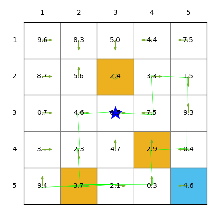

## Quick Start for Python Version

To run the example, follow the procedures:

Ensure the following packages are installed: `numpy` and `matplotlib`

Design your grid world environment in `examples/arguments.py`. For example, to specify the target state, modify the default value in the following sentence:

```python
parser.add_argument("--target-state", type=Union[list, tuple, np.ndarray], default=(4,4))
```

Change directory to the file `examples/`

```bash
cd examples
```

Run the script:

```bash
python example_grid_world.py
```

You will see a similar animation as shown below:




## Change Argument 

**Open examples/arguments.py, and you can change arguments:**

"env-size" denotes the the number of columns and rows of the grid world. 

the coordinate system for All the states in the environment, e.g., start-state, target-state and forbidden-states, here aligns with the conventional setup in Python, where `(0, 0)` is typically used as the origin of coordinates.


If you want to save figures in each step, please modify the "debug" argument to  "True":

```bash
parser.add_argument("--debug", type=bool, default=True)
```


## Installation

We support Python 3.7, 3.8, 3.9,  3.10 and 3.11. Make sure the following packages are installed: `numpy` and `matplotlib`.


## API Interface

The grid world environments as simple Python `env` classes. Creating the grid world environment instances and interacting with them is very simple:

```python
from src.grid_world import GridWorld

 	env = GridWorld()
    state = env.reset()               
    for t in range(20):
        env.render()
        action = np.random.choice(env.action_space)
        next_state, reward, done, info = env.step(action)
        print(f"Step: {t}, Action: {action}, Next state: {next_state+(np.array([1,1]))}, Reward: {reward}, Done: {done}")

```


The policy is constructed as a matrix form, which can be designed to be deterministic or stochastic:

 ```python
     policy_matrix=np.random.rand(env.num_states,len(env.action_space))                                       
     policy_matrix /= policy_matrix.sum(axis=1)[:, np.newaxis] 
 ```

Moreover, If the length of the arrow is too large, you can open src/grid_world.py, and change the magnitude of the length:

 ```python
self.ax.add_patch(patches.FancyArrow(x, y, dx=(0.1+action_probability/2)*dx, dy=(0.1+action_probability/2)*dy, color=self.color_policy, width=0.001, head_width=0.05))    
 ```


 To add state values:

```python
values = np.random.uniform(0,10,(env.num_states,))
env.add_state_values(values)
```


To render the environment:

```python
env.render(animation_interval=3)    # the figure will stop for 3 seconds
```


## About the Authors

The instructor's homepage https://www.shiyuzhao.net/ (Google Site) and the research group website [https://shiyuzhao.westlake.edu.cn](https://shiyuzhao.westlake.edu.cn/).

The python code for the grid environment is now maintained by Yize Mi miyize@westlake.edu.cn. The original version of the code is provided by Jianan Li (lijianan@westlake.edu.cn) (has graduated).
