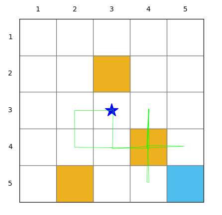
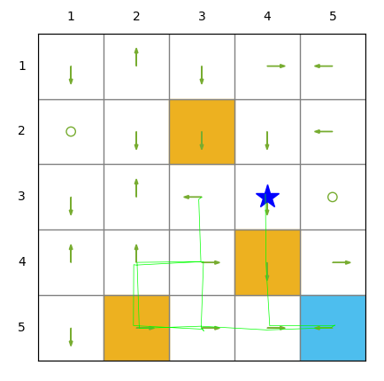
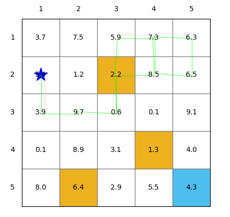
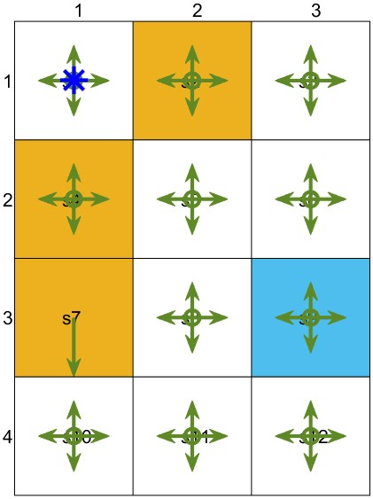
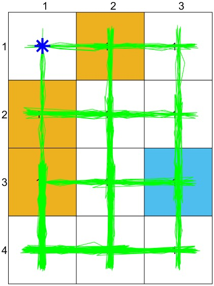
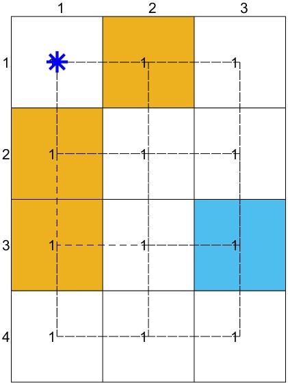
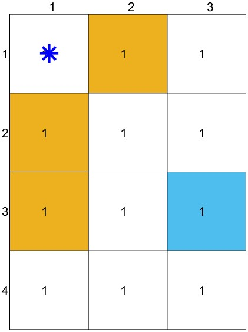

# Code for the Grid-World Environment 

## Overview

We added the code for the grid-world environment in my book. Interested readers can develop and test their own algorithms in this environment. Both Python and MATLAB versions are provided.

Please note that we do not provide the code of all the algorithms involved in the book. That is because they are the homework for the students in offline teaching: the students need to develop their own algorithms using the provided environment. Nevertheless, there are third-party implementations of some algorithms. Interested readers can check the links on the home page of the book.

I need to thank my PhD students, Yize Mi and Jianan Li, who are also the Teaching Assistants of my offline teaching. They contributed greatly to the code.

You are welcome to provide any feedback about the code such as bugs if detected.

----

## Python Version

### Requirements

- We support Python 3.7, 3.8, 3.9,  3.10 and 3.11. Make sure the following packages are installed: `numpy` and `matplotlib`.


### How to Run the Default Example

To run the example, please follow the procedures :

1. Change the directory to the file `examples/`

```bash
cd examples
```

2. Run the script:

```bash
python example_grid_world.py
```

You will see an animation as shown below:

- The blue star denotes the agent's current position within the grid world.
- The arrows on each grid illustrate the policy for that state. 
- The green line traces the agent's historical trajectory. 
- Obstacles are marked with yellow grids. 
- The target state is indicated by a blue grid. 
- The numerical values displayed on each grid represent the state values, which are initially generated as random numbers between 0 and 10. You may need to design your own algorithms to calculate these state values later on. 
- The horizontal number list above the grid world represents the horizontal coordinates (x-axis) of each grid.
- The vertical number list on the left side represents their vertical coordinates (y-axis).


### Customize the Parameters of the Grid World Environment

If you would like to customize your own grid world environment, please open `examples/arguments.py` and then change the following arguments:

"**env-size**", "**start-state**", "**target-state**", "**forbidden-states**", "**reward-target**", "**reward-forbidden**", "**reward-step**":

- "env-size" is represented as a tuple, where the first element represents the column index (horizontal coordinate), and the second element represents the row index (vertical coordinate).

- "start-state" denotes where the agent starts.

- "target-state" denotes the position of the target. 

- "forbidden-states" denotes the positions of obstacles. 

- "reward-target", "reward-forbidden" and "reward-step" represent the reward when reaching the target, the reward when entering a forbidden area, and the reward for each step, respectively.  

An example is shown below:

To specify the target state, modify the default value in the following sentence:

```python
parser.add_argument("--target-state", type=Union[list, tuple, np.ndarray], default=(4,4))
```

Please note that the coordinate system used for all states within the environment—such as the start state, target state, and forbidden states—adheres to the conventional Python setup. In this system, the point `(0, 0)` is commonly designated as the origin of coordinates.


If you want to save figures in each step, please modify the "debug" argument to  "True":

```bash
parser.add_argument("--debug", type=bool, default=True)
```


### Create an Instance

If you would like to use the grid world environment to test your own RL algorithms, it is necessary to create an instance. The procedure for creating an instance and interacting with it can be found in `examples/example_grid_world.py`:

```python
from src.grid_world import GridWorld

 	env = GridWorld()
    state = env.reset()               
    for t in range(20):
        env.render()
        action = np.random.choice(env.action_space)
        next_state, reward, done, info = env.step(action)
        print(f"Step: {t}, Action: {action}, Next state: {next_state+(np.array([1,1]))}, Reward: {reward}, Done: {done}")

```



- The policy is constructed as a matrix form shown below, which can be designed to be deterministic or stochastic. The example is a stochastic version:


 ```python
     # Add policy
     policy_matrix=np.random.rand(env.num_states,len(env.action_space))                                       
     policy_matrix /= policy_matrix.sum(axis=1)[:, np.newaxis] 
 ```

- Moreover, to change the shape of the arrows, you can open `src/grid_world.py`:


 ```python
self.ax.add_patch(patches.FancyArrow(x, y, dx=(0.1+action_probability/2)*dx, dy=(0.1+action_probability/2)*dy, color=self.color_policy, width=0.001, head_width=0.05))   
 ```




-  To add state value to each grid:


```python
values = np.random.uniform(0,10,(env.num_states,))
env.add_state_values(values)
```



- To render the environment:


```python
env.render(animation_interval=3)    # the figure will stop for 3 seconds
```

------

## MATLAB Version

### Requirements

- MATLAB >= R2020a, in order to implement the function *exportgraphics()*.

### How to Run the Default Example

Please start the m-file `main.m`. 

Four figures will be generated: 

The first figure is to show the policy: The length of an arrow is proportional to the probability of choosing this action, and the circle represents the agent would stay still. The meanings of other graphics and colors in this visualization are consistent with those used in Python.



The shape of the arrow can be customized in `figure_plot_1.m`

```matlab
function drawPolicyArrow(kk, ind, i_bias, j_bias, kk_new, ratio, greenColor, action)
    % Obtain the action vector
    action = action{kk};

    % For the non-moving action, draw a circle
    if action(1) == 0 && action(2) == 0  % Assuming the fifth action is to stay
        plot(i_bias(ind), j_bias(ind), 'o', 'MarkerSize', 8, 'linewidth', 2, 'color', greenColor);
        return;
    else
        arrow = annotation('arrow', 'Position', [i_bias(ind), j_bias(ind), ratio * kk_new * action(1), - ratio * kk_new * action(2)], 'LineStyle', '-', 'Color', greenColor, 'LineWidth', 2);
        arrow.Parent = gca;
    end
end
```

The second and the third figures are used to draw the trajectory in two different manners: The former is for the trajectory generated by a stochastic policy. The latter is provided to show the deterministic trajectory. 





The fourth figure is used to show the state value for each state. 



### Code Description

- The main reinforcement learning algorithm is shown below:


```matlab
for step = 1:episode_length
    action = stochastic_policy(state_history(step, :), action_space, policy, x_length, y_length);   
    % Calculate the new state and reward
    [new_state, reward] = next_state_and_reward(state_history(step, :), action, x_length, y_length, final_state, obstacle_state, reward_forbidden, reward_target, reward_step);
    % Update state and reward history
    state_history(step+1, :) = new_state;
    reward_history(step) = reward;
end
```

- The policy is shown as:


```matlab
function action = stochastic_policy(state, action_space, policy, x_length, y_length)
    % Extract the action space and policy for a specific state
    state_1d = x_length * (state(2)-1) + state(1); 
    actions = action_space{state_1d};
    policy_i = policy(state_1d, :);

    % Ensure the sum of policy probabilities is 1
    assert(sum(policy_i) == 1, 'The sum of policy probabilities must be 1.');
    
    % Generate a random index based on policy probabilities
    action_index = randsrc(1, 1, [1:length(actions); policy_i]);
    
    % Select an action
    action = actions{action_index};
end
```

- The state transition function is shown below:


```matlab
function [new_state, reward] = next_state_and_reward(state, action, x_length, y_length, target_state, obstacle_state, reward_forbidden, reward_target, reward_step)
    new_x = state(1) + action(1);
    new_y = state(2) + action(2);
    new_state = [new_x, new_y];

    % Check if the new state is out of bounds
    if new_x < 1 || new_x > x_length || new_y < 1 || new_y > y_length
        new_state = state;
        reward = reward_forbidden;
    elseif ismember(new_state, obstacle_state, 'rows')
        % If the new state is an obstacle
        reward = reward_forbidden;
    elseif isequal(new_state, target_state)
        % If the new state is the target state
        reward = reward_target;
    else
         % If the new state is a normal cell
        reward = reward_step;
    end
end
```
