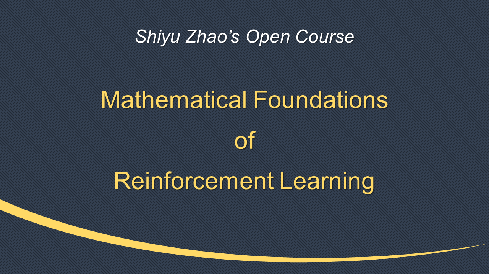

# (Jul 2024) English lecture videos!

[](https://youtube.com/playlist?list=PLEhdbSEZZbDaFWPX4gehhwB9vJZJ1DNm8&si=D1T4pcyHsMxj6CzB)

**My English open course is online now.** You can click the above figure or the [link here](https://youtube.com/playlist?list=PLEhdbSEZZbDaFWPX4gehhwB9vJZJ1DNm8&si=D1T4pcyHsMxj6CzB) to jump to our YouTube channel. You can also click the following links to be directed to specific lecture videos.

- [Overview of Reinforcement Learning in 30 Minutes](https://youtu.be/ZHMWHr9811U?si=TYgsYtppjLR_qBY-)
- [L1: Basic Concepts (P1-State, action, policy, ...)](https://youtu.be/3yZcHdWi7FY?si=ITq6iHd8aP6T2Uj5)
- [L1: Basic Concepts (P2-Reward,return, Markov decision process)](https://youtu.be/6JH6RkmSr3I?si=BfM_RqNvF2Q9krSF)
- [L2: Bellman Equation (P1-Motivating examples)](https://youtu.be/OeuoRUhqIro?si=isKK5ALM4SrMty9y)
- [L2: Bellman Equation (P2-State value)](https://youtu.be/1WHpY0ajFu8?si=wQW0wnV5-cYOZv32)
- [L2: Bellman Equation (P3-Bellman equation-Derivation)](https://youtu.be/6DiGNDWMOp0?si=5Vgj_Dfva505v-DZ)
- [L2: Bellman Equation (P4-Matrix-vector form and solution)](https://youtu.be/ErvbMyzB_WM?si=blvi_TyxZGxNGOVV)
- [L2: Bellman Equation (P5-Action value)](https://youtu.be/RJJ09pbjT6o?si=u_0nTyRe4VSVe_-h)
- [L3: Bellman Optimality Equation (P1-Motivating example)](https://youtu.be/n3T3Ue9iLJk?si=f04I7TGc7PtUwNPw)
- [L3: Bellman Optimality Equation (P2-Optimal policy)](https://youtu.be/9952_YPmTJ0?si=HVnURFWA8y9Iuata)
- [L3: Bellman Optimality Equation (P3-More on BOE)](https://youtu.be/jxcFmZmKNAg?si=o706FlazJw8vYTOn)
- [L3: Bellman Optimality Equation (P4-Interesting properties)](https://youtu.be/4SeEvwbO9ns?si=yaCzuzow8s6psrLG)
- More videos are on the way.

There will be about 50 short lecture videos that last for about 11 hours long in total. The rest of the videos will be uploaded within the next few months. Please stay tuned!

You are warmly welcome to check out the English videos to see if they are helpful!

# (Jul 2024) 2500+ stars and 900,000+ views

The book has received 2500+ stars on GitHub! The lecture videos (Chinese version) have been quite popular and have received 900,000+ views in total over the Internet.

***

# Why a new book on reinforcement learning?

This book aims to provide a **mathematical but friendly** introduction to the fundamental concepts, basic problems, and classic algorithms in reinforcement learning. Some essential features of this book are highlighted as follows.

- The book introduces reinforcement learning from a mathematical point of view. Hopefully, readers will not only know the procedure of an algorithm but also understand why it was designed in the first place and why it works effectively.

- The depth of the mathematics is carefully controlled to an adequate level. The mathematics is also presented in a carefully designed manner to ensure that the book is friendly to read. Readers can selectively read the materials presented in gray boxes according to their interests.

- Many illustrative examples are given to help readers better understand the topics. All the examples in this book are based on a grid world task, which is easy to understand and helpful for illustrating concepts and algorithms.

- When introducing an algorithm, the book aims to separate its core idea from complications that may be distracting. In this way, readers can better grasp the core idea of an algorithm.

- The contents of the book are coherently organized. Each chapter is built based on the preceding chapter and lays a necessary foundation for the subsequent one.

# Contents

The topics addressed in the book are shown in the figure below. This book contains ten chapters, which can be classified into two parts: the first part is about basic tools, and the second part is about algorithms. The ten chapters are highly correlated. In general, it is necessary to study the earlier chapters first before the later ones.


# Readership

This book is designed for senior undergraduate students, graduate students, researchers, and practitioners interested in reinforcement learning.

It does not require readers to have any background in reinforcement learning because it starts by introducing the most basic concepts. If the reader already has some background in reinforcement learning, I believe the book can help them understand some topics more deeply or provide different perspectives.

This book, however, requires the reader to have some knowledge of probability theory and linear algebra. Some basics of the required mathematics are also included in the appendix of this book.

# Lecture videos 

By combining the book with my lecture videos, I believe you can study better. 

- **Chinese lecture videos:** You can check the Bilibili channel https://space.bilibili.com/2044042934 or the Youtube channel https://www.youtube.com/channel/UCztGtS5YYiNv8x3pj9hLVgg/playlists
The lecture videos have received **800,000+ views** up to May 2024 over the Internet and received very good feedback!

- **English lecture videos:** I have been working on the English lecture videos. Hopefully we can finish in 2024. Please stay tuned.

# About the author
You can find my info on my homepage https://www.shiyuzhao.net/ (GoogleSite) and my research group website https://shiyuzhao.westlake.edu.cn

I have been teaching a graduate-level course on reinforcement learning since 2019. Along with teaching, I have been preparing this book as the lecture notes for my students. 

I sincerely hope this book can help readers smoothly enter the exciting field of reinforcement learning.

# Citation

```
@book{zhao2024RLBook,
  title={Mathematical Foundations of Reinforcement Learning},
  author={S. Zhao},
  year={2024},
  publisher={Springer Nature Press}
}
```

# Third-party code and materials

Many enthusiastic readers sent me the source code or notes that they developed when they studied this book. I am happy to share the links here and hope they may be helpful to other readers. I must emphasize that I have not verified the code. If you have any questions, you can directly contact the developers. 

**Code**

*Python:*

- https://github.com/ziwenhahaha/Code-of-RL-Beginning by RLGamer (Mar 2024)
  - Videos for code explanation: https://www.bilibili.com/video/BV1fW421w7NH

- https://github.com/jwk1rose/RL_Learning by Wenkang Ji (Feb 2024)

*R:*

- https://github.com/NewbieToEverything/Code-Mathmatical-Foundation-of-Reinforcement-Learning

*C++:*

- https://github.com/purundong/test_rl


**Study notes**

*English:*

- https://lyk-love.cn/tags/reinforcement-learning/ 
by a graduate student from UC Davis

*Chinese:* 

- https://zhuanlan.zhihu.com/p/692207843 

- https://blog.csdn.net/qq_64671439/category_12540921.html

- http://t.csdnimg.cn/EH4rj

- https://blog.csdn.net/LvGreat/article/details/135454738

- https://xinzhe.blog.csdn.net/article/details/129452000  

- https://blog.csdn.net/v20000727/article/details/136870879?spm=1001.2014.3001.5502

There are also many others notes made by many other readers on the Internet. You are welcome to recommend to me if you find a good one.

# Update history 

**(Jun 2024) Minor update before printing**

This is the fourth version of the book draft. It is supposed to be the final one before the book is officially published. Specifically, when proofreading the book manuscript, I detected some very minor issues. Together with some reported by enthusiastic readers, they have been revised in this version.

**(Apr 2024) Code for the Grid-World Environment**

We added the code for the grid-world environment in my book. Interested readers can develop and test their own algorithms in this environment. Both Python and MATLAB versions are provided.

Please note that we do not provide the code of all the algorithms involved in the book. That is because they are the homework for the students in offline teaching: the students need to develop their own algorithms using the provided environment. Nevertheless, there are third-party implementations of some algorithms. Interested readers can check the links on the home page of the book.

I need to thank my PhD students, Yize Mi and Jianan Li, who are also the Teaching Assistants of my offline teaching. They contributed greatly to the code.

You are welcome to provide any feedback about the code such as bugs if detected.

**(Mar 2024) 2K stars**

The book has received 2K stars. I also received many positive evaluations of the book from many readers. Very glad that it can be helpful. 

**(Mar 2024) Minor update**

The third version of the draft of the book is online now.

Compared to the second version, the third version is improved in the sense that some minor typos have been corrected. Here, I would like to thank the readers who sent me their feedback. 

**(Sep 2023) 1000+ stars**

The book received 1000+ stars! Thank everybody!

**(Aug 2023) Major update - second version**

*The second version of the draft of the book is online now!!*

Compared to the first version, which was online one year ago, the second version has been improved in various ways. For example, we replotted most of the figures, reorganized some contents to make them clearer, corrected some typos, and added Chapter 10, which was not included in the first version. 

I put the first draft of this book online in August 2022. Up to now, I have received valuable feedback from many readers worldwide. I want to express my gratitude to these readers.

**(Nov 2022) Will be jointly published**

This book will be published *jointly by Springer Nature and Tsinghua University Press*. It will probably be printed in the second half of 2023.

I have received some comments and suggestions about this book from some readers. Thanks a lot, and I appreciate it. I am still collecting feedback and will probably revise the draft in several months. Your feedback can make this book more helpful for other readers!

**(Oct 2022) Lecture notes and vidoes**

The *lecture slides* have been uploaded in the folder "Lecture slides."

The *lecture videos* (in Chinese) are online. Please check our Bilibili channel https://space.bilibili.com/2044042934 or the Youtube channel https://www.youtube.com/channel/UCztGtS5YYiNv8x3pj9hLVgg/playlists

**(Aug 2022) First draft**

The first draft of the book is online.
